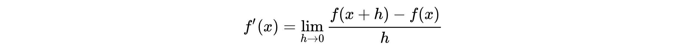
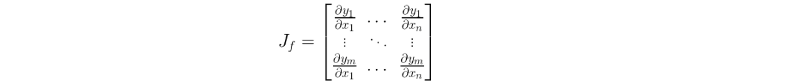
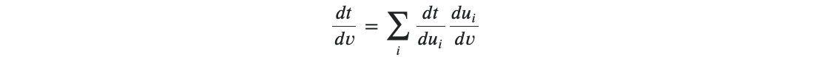

## Background

Differentiation has its applications everywhere from finding zeros of functions to the back propagation algorithm in Deep Neural Networks. In this repository, we implement a library that uses Automatic Differentiation to find the derivatives of real and vector valued functions.

### Why Automatic Differentiation

The other prominent choices for implementing differentiation are __Symbolic Differentiation__ and __Finite Difference__. However, both methods have their drawbacks.
* __Symbolic Differentiation__ - This involves breaking down a given expression into subsequently simpler expressions and we are able to achieve machine precision. However, in doing so, this method tends to be slow and expensive to evaluate.
* __Finite Difference__ - Relies on the Taylor Series expansion and is very fast to evaluate. However, it suffers from poor accuracy, owing to a difficulty in selecting an appropriate value for h:

Automatic Differentiation overcomes both these limitations.

### How it Works

Automatic Differentiation is a set of techniques that allow us to efficiently compute derivatives of functions that are implemented as programs. It is able to provide derivatives with machine precision, with almost the same time as it takes to evaluate the function itself. It does so by taking advantage of an important trait of __Dual Numbers__.

#### Dual Numbers

These are numbers of the form <i>a + bε</i>, where ε2 = 0. Because of this property, applying the Taylor Series expansion to a function about a dual number will result in: f(a + ε) = f(a) + εf'(a).

#### AD Modes

Automatic Differentiation is implemented in 2 flavors.

##### Forward Mode

In this mode, the function and the derivative are evaluated with respect to each input variable. The derivative is computed along with the value of the function about the given input and there is no memory overhead. For the vector valued function <i>f : Rn → Rm</i>, the derivative of each output with respect to each input is represented using a Jacobian Matrix.

The forward mode is more suitable for functions where `m >> n`.

##### Reverse Mode

This mode, on the other hand, is better for functions with `n >> m`. Reverse mode AD involves 2 passes:
* A `forward pass` in which the function is decomposed into a set of primitive expressions
* A `reverse pass` which takes advantage of the Chain rule for multiple variables, to calculate the derivative of each node of the computation graph, with respect to its parents.

