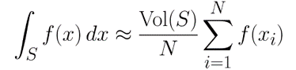

# Milestone 3

## Introduction

Differentiation has its applications everywhere. Some examples are:
* Finding zeros of functions - many problems in Engineering and Science require determining the maximum and minimum values such as the amount of material required in the construction industry, profit and loss calculation, etc.
* Modelling the behaviour of moving objects
* The Back propagation algorithm in Deep Neural Networks

In this repository, we implement a library that uses __Automatic Differentiation__ to find the derivatives of real and vector valued functions.

<hr/>

## Background

### Why Automatic Differentiation

The other prominent choices for implementing differentiation are __Symbolic Differentiation__ and __Finite Difference__. However, both methods have their drawbacks.
* __Symbolic Differentiation__ - This involves breaking down a given expression into subsequently simpler expressions and we are able to achieve machine precision. However, in doing so, this method tends to be slow and expensive to evaluate.
* __Finite Difference__ - Relies on the Taylor Series expansion and is very fast to evaluate. However, it suffers from poor accuracy, owing to a difficulty in selecting an appropriate value for h, since very small h values run up against floating-point imprecision:


Automatic Differentiation overcomes both these limitations.

### How it Works

Automatic Differentiation is a set of techniques that allow us to efficiently compute derivatives of functions that are implemented as programs. It is able to provide derivatives with machine precision, with almost the same time as it takes to evaluate the function itself. It does so by taking advantage of an important trait of __Dual Numbers__.

#### Dual Numbers

These are numbers of the form <i>a + bε</i>, where ε<sup>2</sup> = 0. Because of this property, applying the Taylor Series expansion to a function about a dual number will result in: f(a + ε) = f(a) + εf'(a).

#### AD Modes

Automatic Differentiation is implemented in 2 flavors.

##### Forward Mode

In this mode, the function and the derivative are evaluated with respect to each input variable. The derivative is computed along with the value of the function about the given input and there is no memory overhead. For the vector valued function <i>f : R<sup>n</sup> → R<sup>m</sup></i>, the derivative of each output with respect to each input is represented using a Jacobian Matrix.


The forward mode is more suitable for functions where `m >> n`.

##### Reverse Mode

This mode, on the other hand, is better for functions with `n >> m`. Reverse mode AD involves 2 passes:
* A __forward pass__ in which the function is decomposed into a set of primitive expressions
* A __reverse pass__ which takes advantage of the Chain rule for multiple variables, to calculate the derivative of each node of the computation graph, with respect to its parents.


<hr/>

## How to use *OffPiste*

*OffPiste* will be used as an API.   

### **What should users import?**  

An example is included in the `example_usage` directory. Users can choose to compile our library from the source code and link it to their driver scripts, or use the artifacts published in Github Releases.

#### Compile OffPiste from Source Code
1. Clone this repo
2. Compile the `OffPiste` library using:
```
$ cd example_usage/
$ make compile_dependencies
```
This will compile the source code for the dependency into a `.so` (Linux) / `.dylib` (Mac) dynamically linked library which is placed under `../OffPiste/install/lib`.
3. Compile the code that uses the `OffPiste` library (as an example, `example.cpp`) and run it:
```
$ make run
```

#### Use the published Artifacts
1. Obtain the header file and compiled `.so` (Linux) / `.dylib` (Mac) from the latest [Github Release](https://github.com/CS107-off-piste/cs107-FinalProject/releases)
2. Compile the source code that uses the `OffPiste` library by:
* include the downloaded header files in the source code
* Linking to the compiled `OffPiste` library using:
```
$ g++ --std=c++14 -Wall ${SRC_FILES} -o example.o -L${LIBRARY_PATH} -lOffPiste
```
(with `${LIBRARY_PATH}` as the folder containing the downloaded library file, and `${SRC_FILES}` as the paths of the source files).

### **How can users instantiate AD objects?**  

The OffPiste library has an intuitive interface that is achieved by mimicking `cmath` functions and overloading operators. Sample code may be found in [example.cpp](../example_usage/example.cpp).

<hr/>

## Software Organisation

### What will the directory structure look like?

The project's main directories are:

* `OffPiste/` which contains the C++ source files, header files, and tests for the core automatic differentiation library.
    * `OffPiste/core/src` contains the source code for OffPiste library
    * `OffPiste/core/tests` contains unit and functional tests for the OffPiste library 
    * `OffPiste/include` contains the header files for the OffPiste library
    * `OffPiste/coverage` contains information relating to the code coverage of the unit and functional tests
    * `OffPiste/install` contains the compiled `.so` library. 
* `docs/` which contains files such as this one, documenting the library and development process. 
    * `docs/doxygen` contains html documentation for the `OffPiste` library's functions.
* `example_usage` contains an example project showing how you can use the `OffPiste` library
* `3PL` contains 3rd party components. At present, this is just Google test.

### What are the basic modules?

The core module is implemented in `OffPiste/core/src`. This is where the source code for the automatic differentiation library is held. The header file for this source code is in `Offpiste/include`. This header file also includes the in-line documentation for each function.

The root directory has a `./config.sh` file. This is a shell script that reads in a user's command and executes actions (such as compiling the library, generating documentation, or generating coverage information). Depending on the arguments passed to it, `./config.sh` calls `OffPiste/config.sh`, `OffPiste/coverage.sh`, and / or `CMake`.

`C++` compilation is handled through `CMake`, using the `CMakeLists.txt` files in `OffPiste/` and its subdirectories. 

### Where do tests live?

As described above, tests for each operation supported by the library are located in `OffPiste/core/tests`.

As described in the `README.md`, tests are run with the command 

```bash
$ ./config.sh --clean # clean up, if needed
# $ ./config.sh --3pl # compile Google Test if needed
$ ./config.sh --library
```

which will re-compile the source code and run the test suite. 

### How can a person install your library?

A user can install our library by cloning the repository from github and running

```
./config.sh
```

to compile the library. This will produce a `.so` (or `.dylib` on a Mac) and `.h` file in `OffPiste/install`. These do not rely on any external components, so the user can use these as described above in the section above titled "How to use OffPiste".  

<hr/>

## Implementation

- **What are the core data structures?**
    The core data structure for each component of vector functions is a Directed Acyclic Graph (DAG) with multiple inputs and multiple outputs.

    In the DAG, each node represents one of the operations in the computational graph of our function. We store our operations in this DAG so that we can traverse the nodes of the DAG (in reverse) when computing the reverse mode.

    e.g. f(x, y, z) = (x + y^2, x - z)

- **What classes will you implement? What method and name attributes will your classes have?**  
    There are three basic classes needed to be implemented: `Node`, `Variable`, `Function`:
    - `Node`: A node of the computational DAG. It has the following attributes and methods:
        - `.backward()`: compute the gradients of all descendents of this node. If not zero_grad the whole computational DAG, the gradients of the descendents 
        will accumulate from their previous gradients. 
        - `._forward_func_ptr()`: represents the operation of this node, including binary and unary operation, e.g. +, -, exp, sin.
        - `._backward_func_ptr()`: represents how the gradient will pass this node in reverse mode.
        - `.val`: the value of this node.
        - `.dval`: the derivative of this node. Used ONLY in forward mode.
        - `.grad`: the gradient of this node w.r.t the node that calls `.backward()`.Used ONLY in reverse mode.
        - `._parents`: a `std::vector<Node*>` containing the pointers to all _parents of this node. A `Node` can have multiple parents.
        - `._children`: a `std::vector<Node*>` containing the pointers to all _children of this node. A `Node` has at most TWO children.
    
    - `Variable`: A derived class of `Node` that represents each input node.
    
    - `Function`: A DAG that containing Nodes, with multiple inputs and multiple outputs.
        - `Function(Input, Output)`: use `Input` and `Output` to initialize a computational DAG.
        - `.evaluate()`: evaluate computational DAG, and return values of output nodes in `std::vector<float>`.
        - `.set_seed(Vec seeds)`: set the seed for each input node in forward mode.
        - `.forward_derivative(Node &output_node, Node &wrt)`: compute the dval of `Node &output_node` wrt `Node &wrt` using forward mode.
        - `.forward_jacobian()`: compute the jacobian using forward mode and return `std::vector<std::vector<float>>`.
        - `.zero_grad()`: set `.grad` of all `Node`s in the computational DAG to 0.
        - `.backward_jabobian()`: compute the jabobian using reverse mode and return `std::vector<std::vector<float>>`.
        - `.bfs()`: a private method that add every node in the graph and its in-degree into `std::map<Node*, size_t> in_deg_book_keeper`.
        - `.generate_aov_sequence`: a private method that generate an feasible AOV sequence of this DAG and store it in `std::vector<Node*> aov_sequence`.
        - `.input_node_ptrs`: a `std::vector<Node*>` that stores the pointers to all input nodes.
        - `.output_node_ptrs`: a `std::vector<Node*>` that stores the pointers to all output nodes.
        - `.in_deg_book_keeper`: a `std::map<Node*, size_t>` with key `Node*` and value the number of the node's children.
        - `.aov_sequence`: a `std::vector<Node*>` that stores a feasible AOV sequence of this DAG. It is obtained by invoking `.generate_aov_sequence()`.
        - `.node2aov_idx`: a `std::map<Node*, size_t>` with key `Node*` and value the index of the `Node` in `.aov_sequence`.

    The classes `UnaryOperator` and `BinaryOperator` have been added to assist in operator overloading. And the classes `ForwardFunctions` and `BackwardFunctions` implement the core logic for the unary and binary functions.

    Other than classes, there are also some type definitions with namespace OP that are helpful.
    - `Expression`: An alias for `Node&`. Each `Expression` is a scalar function of vector input.
    - `Input`: An alias for `std::vector<std::reference_wrapper<Node>>`, which is a vector of input `Variable`s.
    - `output`: An alias for `std::vector<std::reference_wrapper<Node>>`, which is a vector of output `Variable`s.
    - `Vec`: An alias for `std::vector<float>`.
    - `Mat`: An alias for `std::vector<std::vector<float>>`.

- **What external dependencies you rely on?**
    - We do not use any external dependencies in our source code. However, we do use the c standard libraries such as `cmath` for computing the value of some functions, e.g. sin, cos, exp. 
    - We use some external tools outside of our `c++` source code, such as `doxygen` for documentation generation, and `clang-format` for code formatting. These external tools are not required to compile and run the project.

## Our Extension - Automatic Differentiation in the Reverse Mode

In the previous milestone, the forward mode of Automatic Differentiation was implementated by the use of the concept of Dual Numbers and by overloading operators. Since the previous milestone, the implementation of the Automatic Differentiation classes has been refactored to inherently use a DAG, as described in the _Implementation_ section above. With this, the library is able to support the calculation of Jacobian Matrices for the input vectors and functions, in the forward as well as reverse mode. We are also now able to support the differentiation of vector functions of vector values.

### Reverse Mode of Automatic Differentiation

#### Motivation
Forward mode of Automatic Differentiation has one main disadvantage - if we intend to calculate the derivate of the function against each variable, we must seed the function with appropriate values and run it as many times as the number of variables. Thus, forward mode of AD scales linearly as O(n), where _n_ is the number of input variables. In the reverse mode, on the other hand, there are 2 passes of the graph for each function (one forward and one reverse), no matter the number of input variables and the operations scale linearly as O(m), where _m_ is the number of output nodes.

Thus, we can see that both modes of AD are suited to different use cases and we decided to support the Reverse mode of AD as the extention to the required Forward mode.

### Implementation of Reverse Mode

This is discussed in detail in the [Implementation](#implementation) section above.

## Broader Impact and Inclusivity Statement

Differentiation forms the basis for many scientific and engineering computations, from the Newton's method for finding the roots of an equation, to the implementation of Neural Networks used in Deep Learning models. As with all software, the tools, with malicious intentions, may be used for unethical purposes. While we don't believe that the OffPiste library, on its own, could be used to create negative impact, we encourage users of the library to act responsibly.

Through peer reviews and retrospecive examination of the code, we will also continue to evolve it for efficiency and resource consumption. 

### Diversity & Inclusion

The team behind the OffPiste library is multi-cultural in itself, with members spanning across different geographies. Digital connectivity has surely brought the world closer together, but that's not to say that collaboration is easy. This kind of working has brought along its own set of challenges. We recognize this and undertake that we will remain unbiased in our work and dialogues, both within the OffPiste community of users and contributors, as well as outside. And we hope that, you will this stance with us and exercise thoughtfulness and respect towards each other.

Along the same lines, we hope that our source code and software are available and accessible to people from all backgrounds and walks of life. Although development and documentation, at this point, is only done in English, we encourage user forums and discussions in any language and will try our best to assist. Where this proves to be difficult, we seek your understanding in the fact that our time and and resources towards this project are limited and we are unable to cater to speakers of all languages.

Many of the maintainers of this repository also study or work full-time and owing to this, correspondence and attention to code reviews may not be immediate. Please help us streamline our communication by incorporating the guidelines in the document on [Contributing to the Code](../README.md#contributing-to-this-project).

## Future Features

In the future we plan to add support for the following:
* Sparse Matrix Input - There are many physical phenomena involving ordinary differential equations and partial differential equations. And most of them do not have an analytical solution. The most common approach is to discretize the spatial-temporal scope into finite-difference grids. And the point variables usually only tangle with its’ neighbors in the discretized equations. Considering of the number of the grid variables in a common pde problem, it is quite necessary for our package to support sparse matrix inputs and comes out with a sparse Jacobian or Hessian matrix to plug into the implicit methods.
* Back Propagation - This is a centrl component in Neural networks. Since we have implemented the Reverse Mode of AD, it would be easy to wrap it with the Back Propagation algorithm.
* Vector Input - We also want to add an additional support for vector inputs. This functionality is extremely important in inverse rendering in computer graphics. Rendering process is composed of a render tree which recursively traces the parent rays starting from eyes. Inverse graphics techniques seek to find the scene parameters given observed images, for example, the shape and texture of a face, lighting, spatially varying material properties, matching photographs of fabrics, etc. Vision as inverse graphics has a long history in both computer graphics and computer vision. Many techniques in inverse graphics utilize derivatives of the rendering process for inference.
* Sampling function plug-in for differentials of an integral. Note our automatic differentiation is not capable of dealing with integrals because integrals, not like differention, do not obey the chain rule. But integrals is essential to deal with real world problem since it is almost impossible to write out explicit functions for every events. Therefore Monte Carlo method comes in as a popular helper to deal with integrals.

